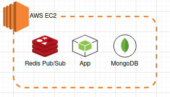
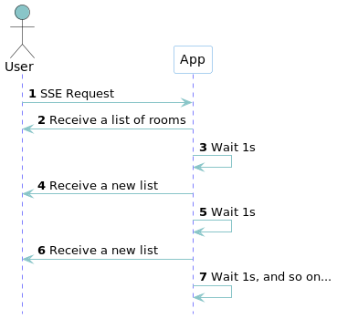
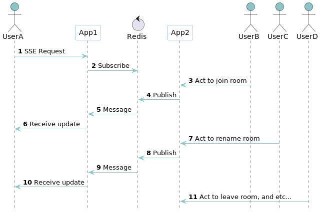

# Тестове завдання для BestWay

В репозиторії знаходиться вихідний код мінімальної імплементації тестового завдання, живе демо туть http://3.76.77.2:3000/.

## Вимоги

Завдання: Зробити підтримку кімнат для гравців в абстрактній грі.

Доступні гравцеві операції:

- отримати список кімнат
- увійти до кімнати зі списку
- створити кімнату і відразу увійти до неї
- виставити кімнаті назву (доступно лише для творця)
- вийти з кімнати

Примітки:

- є обмеження на 10 осіб у кімнаті
- 1 гравець може бути лише в 1 кімнаті за раз
- якщо людей у кімнаті не залишилося, то кімната видаляється
- кімнати у списку повинні оновлюватись, щоб відображати актуальну інформацію
- у списку відображаються такі дані:
    - назва кімнати
    - кількість людей у кімнаті

## Опис

Проект будується з **NodeJS** апки на **NestJS**, **Redis** для обміну івентами через Pub/Sub, та **MongoDB** single replica як бази
даних. Це все запущено на **EC2** інстансі, у **Docker** контейнерах (див. [./docker-compose.yaml](./docker-compose.yaml)).



Для спрощення, весь менеджмент користувачів та авторизація зведені до буквально [одної перемінної в **cookie**, яка і задає ID поточного користувача (**userId**)](src/utils/cookie/set-cookie-user-id.ts).

А у базі даних є буквально одна колекція - **Room **(див. [./prisma/schema.prisma](./prisma/schema.prisma)):

| Name      | Type       |                                           |
|-----------|------------|-------------------------------------------|
| id        | `ObjectID` | Ідентифікатор кімнати                     |
| name      | `String`   | Унікальне ім'я для відображення у списках |
| players   | `String[]` | Поточні учасники кімнати                  |
| createdBy | `String`   | Адміністратор/автор кімнати               |

В рамках цього проекту, я вирішив обрати мінімалістичний фронтенд на основі **[HTMX](https://htmx.org/)**. До цього моменту, я ніколи не мав з ним справи раніше, то ж цей проект став для мене полігоном у його вивченні. Мені сподобалося :blush:  А html рендериться через **[Handlebars](https://handlebarsjs.com/)**.

Для стилізації, використано **[Pure CSS](https://purecss.io/)**, мінімалістичний CSS-фреймворк з базовими елементами форм. Він також для мене в новинку :stuck_out_tongue_winking_eye:

Написано тести на **Jest**, див. [./src/modules/room/room.service.spec.ts](./src/modules/room/room.service.spec.ts)

### API

| Method | Path               | Description                                       |
|--------|--------------------|---------------------------------------------------|
| GET    | `/`                | Головна сторінка                                  |
| SSE    | `/room/sse/list`   | Дістати список кімнат та підписатися на оновлення |
| GET    | `/room/:id`        | Головна сторінка для кімнат                       |
| SSE    | `/room/sse/:id`    | Дістати кімнату та підписатися на оновлення       |
| POST   | `/room/`           | Створити кімнату                                  |
| PUT    | `/room/:id/join`   | Доєднатися до кімнати                             |
| PUT    | `/room/:id/leave`  | Покинути кімнату                                  |
| PATCH  | `/room/:id/rename` | Перейменувати кімнату                             |
| PATCH  | `/user/rename`     | Задати поточний userID                            |
| PATCH  | `/user/random`     | Згенерувати новий випадковий userID               |

### Server Side Events

Для реалізації оновлення даних у реальному часі, використовуються Server Side Events (**SSE**).

Список кімнат відправляється з фіксованою періодичністю:



А оновлення кімнати уже прилітають вибірково, реагуючи на конкретні івенти:



## Запуск інфраструктури

```bash
docker-compose up -d
```

## Встановлення

```bash
pnpm install
```

## Запуск

```bash
nest start
```

## Ліцензія

[MIT licensed](LICENSE).
